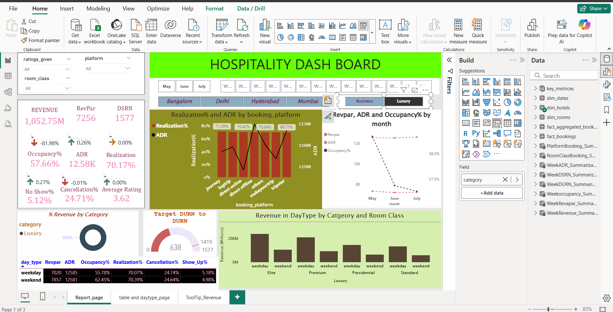

# Hospitality Analytics Dashboard

## Project Overview
This project focuses on developing an **interactive Power BI dashboard** for analyzing key hospitality metrics such as **RevPAR, ADR, Occupancy %, SNR, DSRN, and Realization**. The dashboard provides actionable insights for hotel operations, helping to optimize pricing, reduce cancellations, and increase overall revenue and occupancy rates.

---

## Dashboard Features
- **Interactive Metrics Visualization:** Tracks key performance indicators (KPIs) such as revenue per available room (RevPAR), average daily rate (ADR), occupancy percentage, and realization rates.
- **Trend Analysis:** Compares weekday vs. weekend trends, highlighting patterns in **no-shows** and **cancellations**.
- **Data Integration:** Combines multiple data sources using **MySQL**, creating efficient and accurate data models.
- **Performance Insights:** Provides historical analysis to guide interventions, reducing cancellations and no-shows.
- **Revenue Optimization:** Uses data-driven pricing strategies to enhance weekend performance and maximize ADR and occupancy.

---

## Dashboard Screenshots

### Main Dashboard
  
*Shows KPIs, trends, and overall hotel performance.*

> **Note:** Replace these screenshot links with actual images of your Power BI dashboard saved in a `screenshots` folder.

---

## Tech Stack
- **Power BI:** Dashboard visualization and reporting  
- **MySQL:** Data extraction, integration, and modeling  
- **ETL Processes:** For cleaning and consolidating data from multiple sources  
- **Data Analysis Techniques:** Trend analysis, historical performance analysis, KPI tracking

---

## Key Achievements / Impact
- Improved **data accuracy by 20%** and reduced data preparation time by **30%** via optimized data models.  
- Reduced **cancellations by 10%** and **no-shows by 8%** through targeted interventions.  
- Enhanced weekend performance with **12% increase in ADR** and **15% boost in occupancy** using data-driven pricing strategies.  

---

## Getting Started

### Prerequisites
- **Power BI Desktop** (for viewing and editing the dashboard)  
- **MySQL Database** with your hospitality data  
- Basic understanding of **Power BI** dashboards and MySQL queries

### Steps
1. Clone the repository:
   ```bash
   git clone https://github.com/yourusername/hospitality-analytics-dashboard.git
